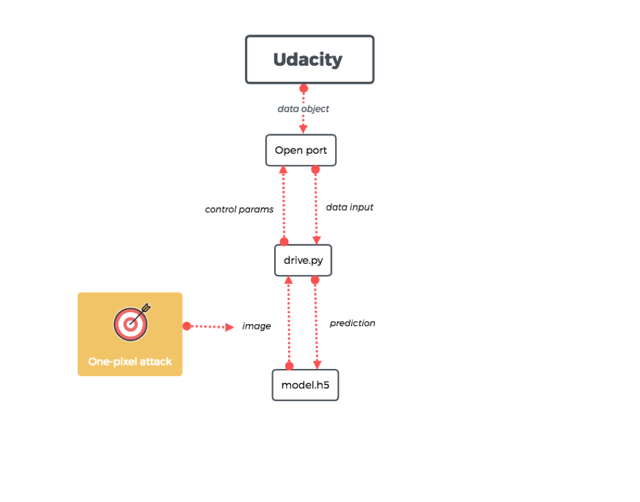
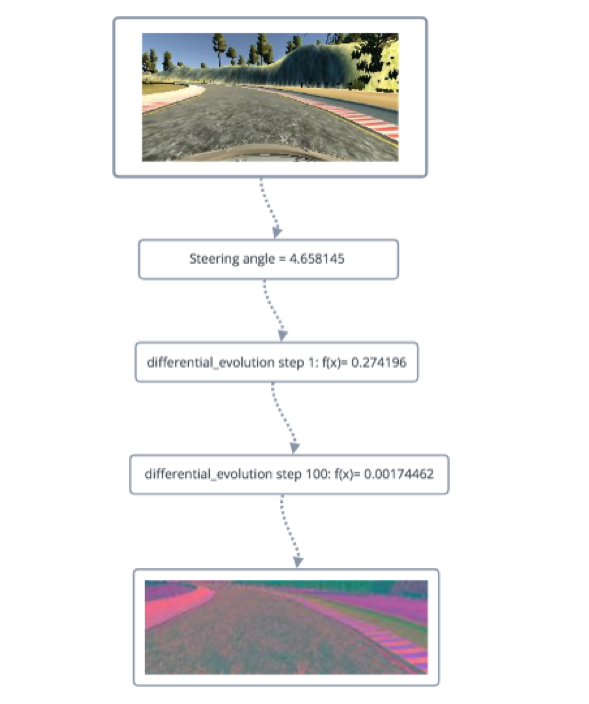

# Autonomous-Cars-Project -- Udacity

This repository contains the files that I worked on during my summer research internship at the Center of Cyber Security at NYU Abu Dhabi. 

<h2>Purpose</h2>
The purpose of this research project was to identify vulnerabilities in autonomous car systems, by looking into open-source self-driving car simulators, such as the <a href = "https://github.com/udacity/CarND-Behavioral-Cloning-P3"> Udacity Behavioral Cloning project </a>. The project explored the cyber security of these sources by implementing attacks such as the one-pixel attack, that tampered with the output (images) produced by the neural network of the self-driving car.

 

<h2>Udacity Behavioral Cloning Project</h2>
The project uses a neural network to clone car driving behavior. It is a supervised regression problem between the car steering angles and the road images in front of a car. The project consists of a simulator that is able to emulate a self-driving car, by provind two user modes:
<h4>Training</h4>
In the training mode, Udacity gathers images from the three cameras: left, center, right and processes them using the augmentation technique and Python generator to generate unlimited number of images. The pre-processing steps are described below:

<ul>
 <li>Randomly choose right, left or center images.</li>
  <li>For left image, steering angle is adjusted by +0.2</li>
 <li>For right image, steering angle is adjusted by -0.2</li>
 <li>Randomly flip image left/right</li>
 <li>Randomly translate image horizontally with steering angle adjustment (0.002 per pixel shift)</li>
 <li>Randomly translate image vertically</li>
 <li>Randomly added shadows</li>
 <li>Randomly altering image brightness (lighter or darker)</li>
 <li>Using the left/right images is useful to train the recovery driving scenario. The horizontal translation is useful for difficult curve handling (i.e. the one after the bridge).</li>
</ul>
The data collected in the training mode is stored in a .csv list that is used to generate a pretrained model (.h5 file) after autonomous mdoe is launched.

<h4>Autonomous Mode</h4>

In autonomous mode, pre-processed images are fed into the CNN which outputs the prediction for the steering angle. Mean squared error is used for the loss function to measure how close the model predicts to the given steering angle for each image. The output of the autonomous mode phase, inclusing steering wheel angle and other such paramaters are stored in .h5 file. 

Source: https://github.com/naokishibuya/car-behavioral-cloning 

<h2>Attack</h2>
The proposed attack model that I used is called the One Pixel Attack for Neural Networks, which desribed in the paper with the same name: Su, Jiawei, Danilo Vasconcellos Vargas, and Kouichi Sakurai. <a href ="https://arxiv.org/pdf/1710.08864.pdf ">  "One pixel attack for fooling deep neural networks." </a> IEEE Transactions on Evolutionary Computation (2019).

The scheme of the Udacity model is described in the image below. However, we notice that it contains a vulnerability that we can later on exploit: <b>the model allows users to feeed in tampered input after training mode is completed, increasing the vulnerability of a cyber attacks</b>.

In the attack models that we propose, we try to make use of this vulnerability. The attack mode scheme is quite straightforward In the attack model, we feed in a tampered pre-processed image, where only pixel was modified, after the training mode completes. Then, we launch autnomous mode and w

<h2>Results and Conclusion</h2>

