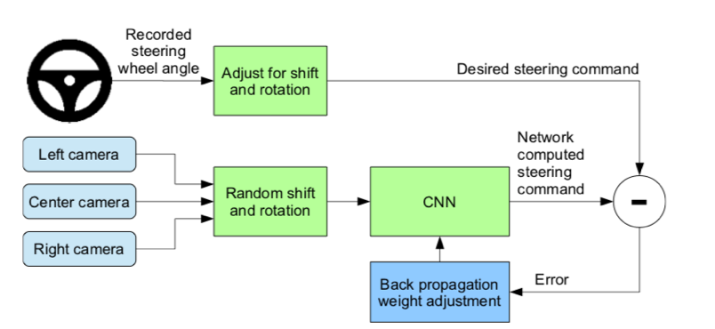
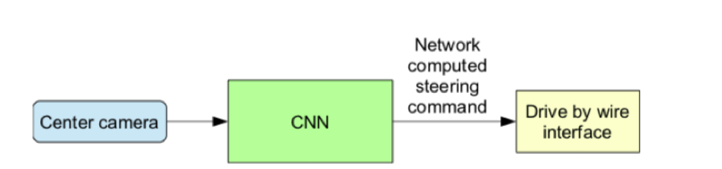

# Autonomous-Cars-Project -- Udacity

This repository contains the files that I worked on during my summer research internship at the Center of Cyber Security at NYU Abu Dhabi. 

<h2>Purpose</h2>
The purpose of this research project was to identify vulnerabilities in autonomous car systems, by looking into open-source self-driving car simulators, such as the <a href = "https://github.com/udacity/CarND-Behavioral-Cloning-P3"> Udacity Behavioral Cloning project </a>. The project explored the cyber security of these sources by implementing attacks such as the one-pixel attack, that tampered with the output (images) produced by the neural network of the self-driving car.

 

<h2>Udacity Behavioral Cloning Project</h2>
The project uses a neural network to clone car driving behavior. It is a supervised regression problem between the car steering angles and the road images in front of a car. The project consists of a simulator that is able to emulate a self-driving car, by provind two user modes:
<h4>Training</h4>
In the training mode, Udacity gathers images from the three cameras: left, center, right and processes them using the augmentation technique and Python generator to generate unlimited number of images. The pre-processing steps are described below:

<ul>
 <li>Randomly choose right, left or center images.</li>
  <li>For left image, steering angle is adjusted by +0.2</li>
 <li>For right image, steering angle is adjusted by -0.2</li>
 <li>Randomly flip image left/right</li>
 <li>Randomly translate image horizontally with steering angle adjustment (0.002 per pixel shift)</li>
 <li>Randomly translate image vertically</li>
 <li>Randomly added shadows</li>
 <li>Randomly altering image brightness (lighter or darker)</li>
 <li>Using the left/right images is useful to train the recovery driving scenario. The horizontal translation is useful for difficult curve handling (i.e. the one after the bridge).</li>
</ul>

Source: https://github.com/naokishibuya/car-behavioral-cloning 

<h4>Autonomous Mode</h4>
All the code is uploaded to the Attack folder. More explanations for how the code works are in my last presentations (Week 7 & 8). 

The instructions for how to install the Udacity self-driving car simulator are in the document under Resources. You can find all the papers referenced in that document too. 
